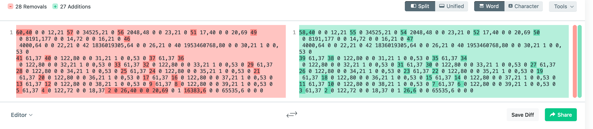
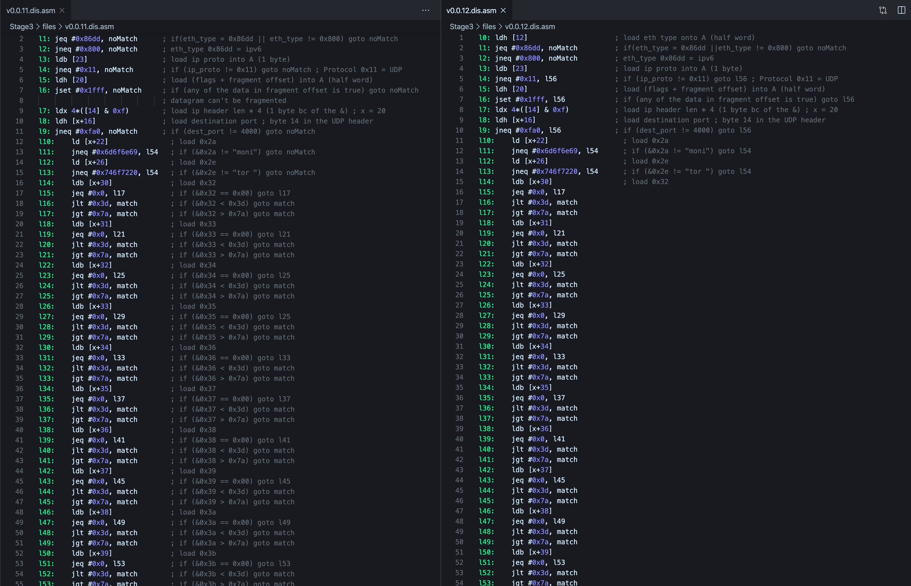

# Solution

## Stage 1

After logging in the first thing i did was to run nmap and `sudo -l`. The latter shows that the user `build` is allowed to run `/usr/bin/docker run -it -v /opt/build-input\:/work fedora\:29 /work/run.sh` as root without entering a password. This command starts a docker server and mounts a directory from the host as a volume into the guest system. It then proceeds to call a script located in `/opt/build-input/run.sh` on the host system. We have permissions to write this file so we can simply overwrite that shellscript with
```
#!/bin/bash
bash
```
 If we now run `/usr/bin/docker run -it -v /opt/build-input\:/work fedora\:29 /work/run.sh` we get a root shell on the docker system. All we need to do to escalate privileges to root on the host, is to write a c programm that spawns a shell, compile it and write the file to `/opt/build-input`, use the modified `run.sh` file to get a root shell inside the container then `chown` the binary to be owned by root and `chmod`ing it to be SETUID. Now we can just exit the docker container and execute our exploit binary. It will prompt us with a root shell :D.

```
~# cat /flag
STAGE1_ahpeeHahy7aingea8ahr6

You have successfully compromised this host. It's time to spread your wings!
```
This vulnerability could have been avoided by not allowing `build` to write files in `/opt/build-input` or by not mounting `/opt/build-input` as a volume, but rather copy the files to the docker container instead.

## Stage 2

The hint in `/flag` tells us to "spread our wings" which probably means, that we need to own other hosts on the network. Our initial reconnaissance revealed the following hosts:
```
172.28.39.11 poseidon
172.28.39.12 repository
172.28.39.13 monitoring
```

There isn't anything too interesting on any of theese servers apart from a webserver on `repository` which
appears to be for the third stage. So the next thing to do is to maybe look for config files on the FS.
TL;DR no interesting config files that reveal some sort of service on one of the other hosts.

One other thing to do ist to try sniffing traffic. Since we're on a `build` server, there has to be some interface to communicate with it. Running `tcpdump -a -vv` should reveral any sort of communication to our
server, it doesn't seem like there is any.
Maybe there we'll be able to find other communication in the local network, since there probably will be some monitoring/updating/api traffic, if the challenge simulates a realistic environment.

A switched network doesn't allow clients on the network to read packages that aren't addressed to them, but we can bypass that using arp spoofing, which basically allows us to MitM traffic.
If we do that for a few hosts and write the results to a file, we can quicly discover some interesting traffic between `poseidon` and `repository`. `poseidon` periodically requests a few files via HTTP from `repository` and there is one particularly interesting header: the `X-Flag` one. It contains the flag for the second stage:
`X-Flag: STAGE2_Aicoh1eHinitei5ol6cee8oo\r\n`

## Stage 3

Now it's time to analyze the requests we saw in the second stage. The `repository` server seems to host some kind of update folder containing a `v0.0.12.bin` and
`v0.0.12.sig`. Downloading these to files from the webserver reverals that the `.sig` file is a pgp signature and the `.bin` contains what looks line a list of numbers.
The string `v0.0.12` looks familiar and thats because the changelog on repository's webserver talked abuot some `v0.0.11` and `v0.0.10`, so `v0.0.12` could be the hotfix that they are
talking about. We can download `v0.0.11.bin` and `v0.0.11.sig` from the webserver and diff it with patched version.


As we can see, there aren't a lot of canges, the only significant change are a few numbers at the end of the list. If we google the similar parts, we can quickly find, that we are looking at compiled bpf bytecode. This can be disassebled using the `pybpf` python module. Now we need to reverse engeneer the two bpf filters to find out what the bug was and how they pachted it.



The new filter contains an additional check for the flags in the IP header. These flags are used to indicate fragmented packets. The old filter could be bypassed by sending fragmented packets and the new version fixes this bug. This bug doesn't help us, if `poseidon` is running the updated version.

We can't build our own filter and pass it to poseidon, since the updates are signed. What we can do is to get poseidon to download the old, vulnerable, version because we have the valid signature for that.
In order to MitM poseidon's connection to repository, we can just simply arpspoof again and this time host our own webserver containing a `firewallUpdate` folder with `latest.bin` and `latest.sig`.
This setup allows us to send arbtirary UPD packets to `poseidon` without having to care about the filter, if we send fragmented packets.

We know, that the monitoring service on poseidon expects `monitor something` as a command. Because thats what
the monitoring server was sending to it. The output we get if we send `monitor ` to the UDP port looks a lot
like the output of the `df` command but it's limited to the `sda` disk. If we send `monitor \x0a` we can get
the full output of the `df` command, which tells us, that there is some sort of filering going on. A bit of playing around with the service let's us assume, that the command their running looks somewhat like this:
```shell
while 1;
do;
read input;
df|grep '^/dev/$input';
done;
```

The new filter they introduced is filtering for non-alphabetical chars, which means that we might be able to
execute a command injection, by entering non-alphabetical chars (because we know how to bypass the filter).
And if we send `monitor '|ls'` we are able to get the filenames in the current directory - including the flag file. All we need to do to read the flag is to send `monitor '|cat<f*'` (we can't enter the full filename because I think there is a length check) and this is what we get:
`The last flag is: FINAL_sahl0ieZ6oojai2sho5oo`
Very cool challenge!
